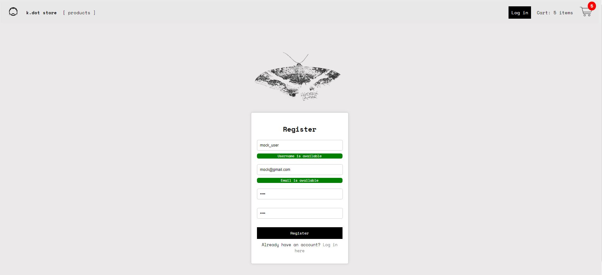

# k.dot Store - Ecommerce API

## Description

Web app for an e-commerce that sells music records. It offers the user the possibility to view the different products listed in the main page, add them to their cart and it has a registration/login functionality implemented.

<b> The application can be viewed and tested here (used Render to deploy) --> https://ecommerce-store-vjg7.onrender.com/ </b>

## Technologies

- Flask: Backend of the app
- HTML & CSS: Structure and styling of the frontend
- SQLAlchemy: Used to handle data storage (products and users credentials)
- Javascript: For client-side validation (informs the user if a username/email is available in real time)

## Features

The user can:

- Check the list of products in the homepage along with their respective prices and add them to the cart:

- Check their cart containing a list of the products added and the total amount along with a basic form (in progress):

- Register, login and reset their password, used JS and Flash messages for client-side validations (check username/email availability and password/confirm password match

   

   
     

